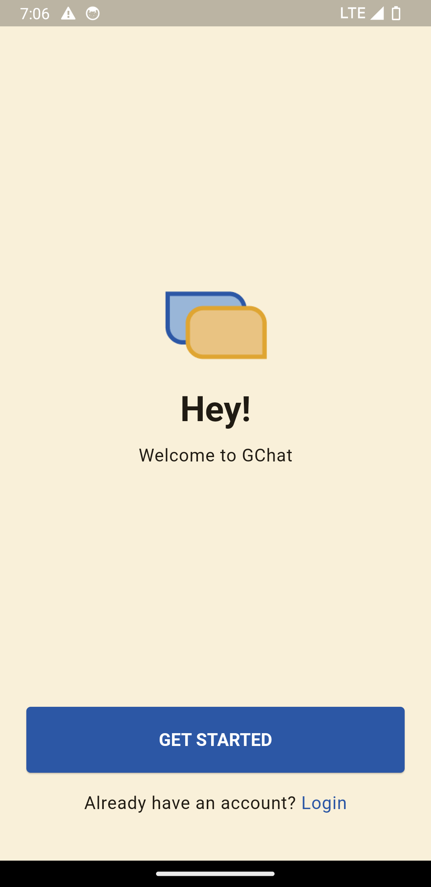
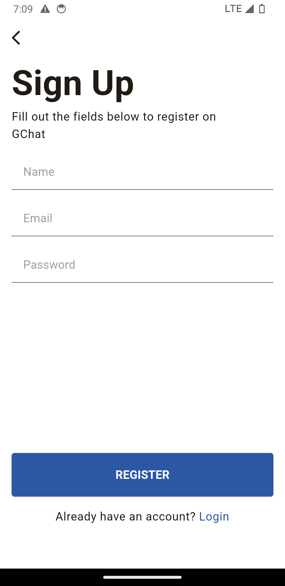
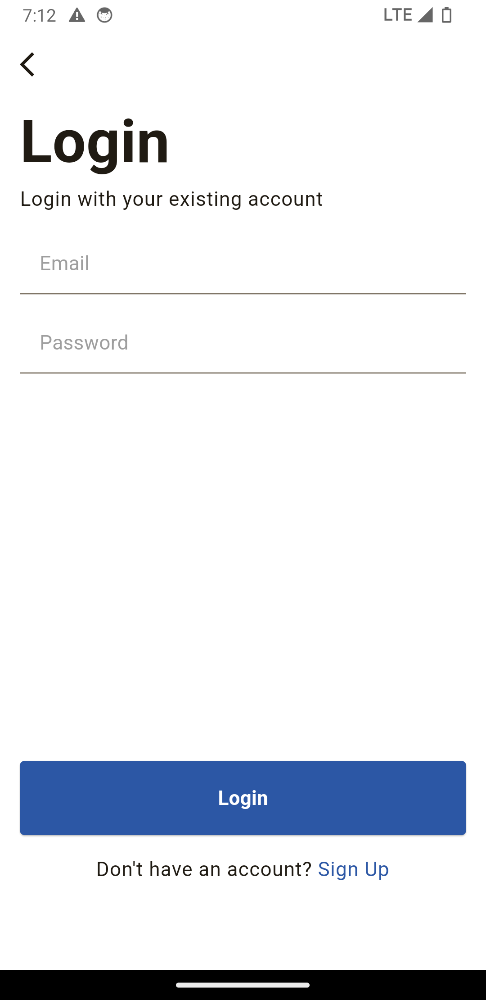
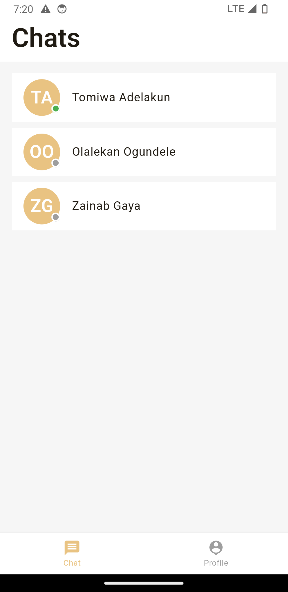
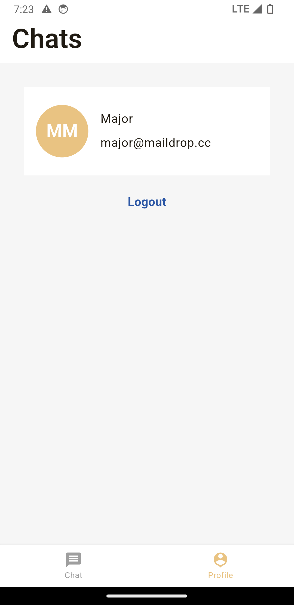
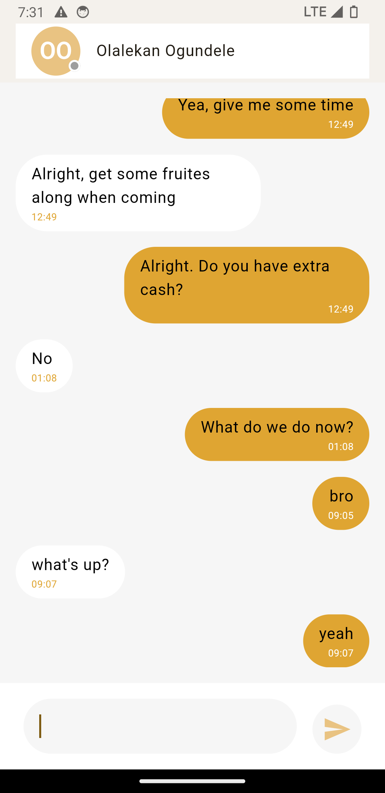

# GChat

GChat is a real-time chat application that allows friends and family to have a text-based conversation in real time. You’re welcome to use any chat back-end of your choice, however, we recommend using Firebase Firestore.

## Built With

- Flutter 3.22.3
- Dart 3.4.4

## Getting Started

- Make sure you have the Flutter SDK installed on your machine
- Clone this repo
- Navigate to the project root directory i.e. contains `pubspec.yaml`
- Run `flutter run`

## Implemented Features

- A user should be able to sign up on GChat
- An existing user should be able to log into GChat
- On successful authentication/signup, a user should be presented with the tabbed home with the Chat tab focused
- A user should be able to see a list of other users on the platform
- A user should be able to send and receive text messages from another user on the platform
- A user should be able to see their profile information
- A user should be able to log out of the application
- Setup Environment configuration for exposing the app to different values based on its current environment
- [Bonus] A user should be able to see history messages in offline mode
- [Bonus] A user should NOT be able to type into the chat text area when their device is offline

## Screenshots

## State Manangement
This app makes use of the *provider* package for state management.
